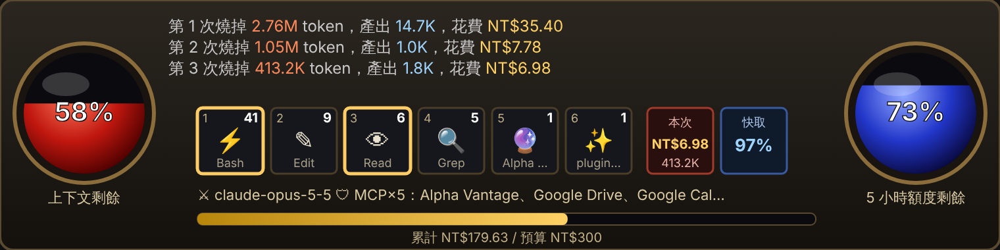

# token-meter

Claude Code mod：暗黑破壞神風格的 token HUD。每次送出燒掉多少 token、花多少錢（美元＋台幣）、還剩多少，自動顯示，不用另外呼叫。



## 會看到什麼

- **每則回覆下方一行**（自動）：`🔥 本次 413.2K token · NT$6.98 · 🔴 上下文剩 58% · 🔵 5 小時額度剩 73% · 💰 累計 NT$179.63 · ⚔ ⚡Bash×41 👁Read×6`
- **`/hud`**：在對話裡畫出圖片版 HUD（上圖），之後每次送出都會自動更新；同時嘗試打開側邊面板（`/hud off` 關閉面板）。內容：
  - 🔴 **紅球＝上下文剩餘**：上下文用完就會被壓縮（compact）
  - 🔵 **藍球＝額度剩餘**：5 小時／7 天額度中最緊的那個；沒有額度資料時改顯示預算剩餘
  - **戰鬥紀錄**：最近 3 次燒掉多少 token、產出多少、花費多少
  - **技能列 1–6**：本 session 最常用的工具、技能（✨）、MCP（🔮）與次數，上一次用到的會亮金框
  - **藥水格**：本次花費與快取命中率
  - **裝備**：⚔ 模型、🛡 連上的 MCP 伺服器
  - **經驗條**：累計花費 ／ 預算
  - 桌面版與手機畫 SVG 圖，終端機畫文字版
- **輸入框上方一行**（精簡文字版，桌面版與終端機）：紅球 % · 本次 token 與台幣 · 技能 · 累計 · 藍球 %
- **狀態列**：`本次 US$0.2188（NT$6.98） ｜ 累計 US$5.6310（NT$179.63）`
- **`/tokens` 指令**：Markdown 報表，最近 10 次的明細表

## 計算方式

- token：把該次送出期間每個 API 回應的用量加總（主對話＋子代理）。「輸入」= 未快取輸入＋快取讀取＋快取寫入。
- 費用：取 Claude Code 自己的費用帳本（與 `/cost`、狀態列同一個數字），算送出前後的差額，所以子代理、快取都已含在內。
- 訂閱制（Pro/Max）下這是「等值 API 價格」，不是實際扣款。

## 台幣匯率

- 預設每次 session 開始時從 `open.er-api.com` 抓 USD/TWD 即時匯率（`/tokens` 會標示「即時」）。
- 抓不到（離線、公司網路擋掉）或關閉即時匯率時，使用設定值，預設 31.9（標示「設定值」）。

## 設定（`/config` → token-meter）

- `twdRate`：備用匯率（1 USD 兌多少 TWD），預設 31.9
- `liveRate`：是否抓即時匯率，預設開
- `budgetTwd`：本 session 預算（台幣），經驗條與藍球備用，預設 300
- `replyLine`：每則回覆下方顯示一行，預設開
- `autoOpen`：session 開始時自動打開 HUD 面板，預設開

## 關閉

- 只關面板：`/hud off`（`/hud` 再打開）
- 不要每次自動打開：`/config` → token-meter → `autoOpen` 關掉
- 不要回覆下方那一行：`/config` → token-meter → `replyLine` 關掉
- 整個停用：`/plugin disable token-meter@fairy715-mods`（`/plugin enable` 恢復）

## 安裝

在終端機的 Claude Code 或桌面版 Code 分頁輸入：

```
/plugin marketplace add fairy715/cc
/plugin install token-meter@fairy715-mods
```

安裝範圍選 user，之後每個 session 都會載入。

## 支援的介面

- **桌面版 Code 分頁**：圖片版 HUD（紅藍球、技能列、裝備）
- **終端機 Claude Code**：文字版 HUD
- **雲端 session（claude.ai/code、手機遠端）**：hook 會執行但不畫面板，用 `/tokens` 看明細
- **Cowork**：官方文件未列入 mod 支援範圍
